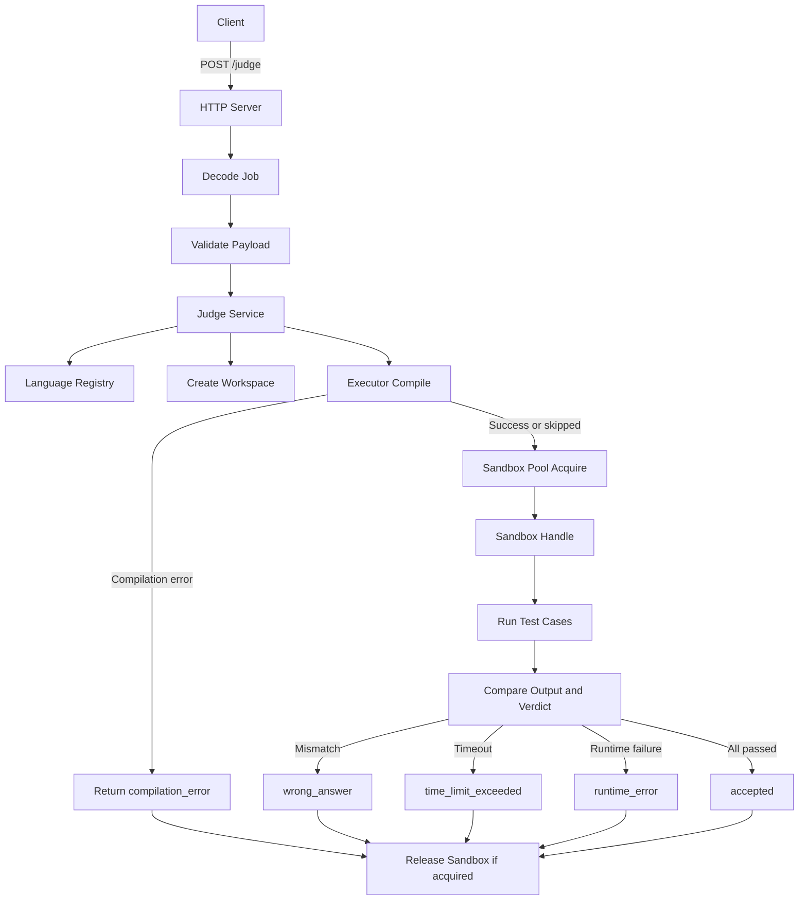
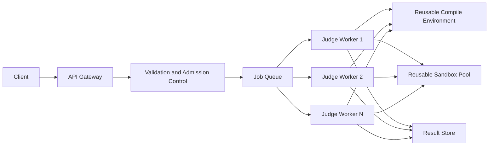

# YexJudge Architecture

## Overview

YexJudge is an online judge that is currently implemented as a synchronous HTTP service, but it is being shaped toward an asynchronous worker-based architecture with reusable execution infrastructure.

The project has two important architectural states:

- the current codebase architecture
- the intended target architecture

The current refactor is focused on making the codebase ready for:

- multiple languages
- reusable runtime sandboxes
- worker pools
- queue-backed asynchronous execution
- stronger API-side validation

## Current Architecture

Today, a submission still flows through the HTTP server request path, but the internal structure is no longer a single large handler.

The code is now split into clear layers:

- HTTP layer in [`cmd/server/main.go`](/home/pixels/Documents/Projects/YexJudge/cmd/server/main.go)
- judge orchestration in [`internal/judge/service.go`](/home/pixels/Documents/Projects/YexJudge/internal/judge/service.go)
- execution mechanics in [`internal/judge/executor.go`](/home/pixels/Documents/Projects/YexJudge/internal/judge/executor.go)
- sandbox lifecycle abstraction in [`internal/judge/pool.go`](/home/pixels/Documents/Projects/YexJudge/internal/judge/pool.go)
- test case loop and verdicting in [`internal/judge/testcases.go`](/home/pixels/Documents/Projects/YexJudge/internal/judge/testcases.go)
- language-specific behavior in [`internal/judge/languages/spec.go`](/home/pixels/Documents/Projects/YexJudge/internal/judge/languages/spec.go)

### Current Flow

### Current Components

#### 1. HTTP Layer

The HTTP layer is intentionally thin.

Responsibilities:

- receive `POST /judge`
- decode request JSON
- enforce request-size limit
- validate obvious bad input early
- call the judge service
- encode the final response

This layer should not contain compilation or execution logic.

#### 2. Judge Service

The judge service is the orchestration layer.

Responsibilities:

- validate jobs defensively
- resolve the language spec
- create the workspace
- compile if the language requires compilation
- acquire a sandbox
- run all test cases
- map execution results into judge verdicts

This is the main business-logic layer of the judge.

#### 3. Executor

The executor is the infrastructure layer that knows how to interact with Docker.

Responsibilities:

- compile code inside the correct compile image
- start a sandbox using the correct runtime image
- release the sandbox
- execute one test case command inside the sandbox

The executor should know how execution happens, but not what verdict should be returned.

#### 4. Sandbox Handle and Pool

The current code already introduces:

- a `Sandbox` handle abstraction
- a `SandboxPool` abstraction

Right now the pool is only a transitional implementation:

- `Acquire` creates a fresh sandbox through the executor
- `Release` removes the sandbox through the executor

This is intentionally done so the service can later switch to a true reusable pool without major changes.

#### 5. Language Registry

Languages are not hardcoded in the service anymore.

Each language spec defines:

- source file name
- whether compilation is required
- compile image
- compile command
- runtime image
- runtime command

The registry maps a requested language string to the correct language spec.

### Current Supported Languages

The codebase is structured to support multiple languages through specs. At this stage the intended supported set includes:

- C++
- C
- Python
- Go
- Java

Whether each language runs successfully depends on the required runtime image being available locally.

### Current Strengths

- HTTP code is much cleaner than the original monolithic handler
- execution logic is no longer mixed with transport logic
- multi-language support now has a proper abstraction
- one sandbox is used for all test cases of a submission
- the codebase is now shaped for future pooling and workerization

### Current Limitations

- execution still happens synchronously in the request path
- a fresh compile container is still created per compiled submission
- a fresh runtime sandbox is still created per submission
- the current sandbox pool is only an abstraction, not a true reusable pool
- results are not persisted
- there is no queue or worker process yet

## Target Architecture

The long-term direction is an asynchronous online judge with dedicated workers, reusable compile infrastructure, and reusable runtime sandboxes.

## Target Principles

### 1. Thin API Gateway

The gateway should only:

- validate payloads
- reject bad or wasteful submissions
- authenticate and rate-limit in future
- enqueue accepted jobs
- expose status and result endpoints

The gateway should not compile or run code directly.

### 2. Queue-Backed Async Execution

Submission execution should move fully out of the HTTP request path.

Target flow:

1. client submits code
2. gateway validates request
3. gateway enqueues job
4. worker picks up job
5. worker compiles code
6. worker borrows sandbox
7. worker runs all test cases
8. worker stores verdict
9. client polls for result

Benefits:

- low-latency API responses
- cleaner fault isolation
- better throughput under burst load
- easier retries and recovery

### 3. Reusable Compile Infrastructure

Compiled languages should not rely forever on one-off compile container startup.

The target model is:

- a reusable compile environment
- or a compile worker pool

This keeps toolchains available without rebuilding execution state for every submission.

Compile and runtime should remain separate concerns. The recommended model is not to use the exact same container for both compile and execution.

### 4. Reusable Runtime Sandbox Pool

Runtime isolation should use a real sandbox pool.

Each worker should:

- acquire one sandbox for the submission
- run all test cases in that sandbox
- reset sandbox state after execution
- release it back to the pool

This is the main path to avoiding repeated runtime container creation per submission while still keeping isolation.

### 5. One Sandbox Per Submission

The execution model should remain:

- one sandbox per submission
- many test cases inside that same sandbox

This keeps execution efficient while preserving clear reset boundaries.

## Recommended End-State

The best balance of speed and security for YexJudge is:

- async API
- queue-backed workers
- separate compile and runtime phases
- reusable compile environments
- reusable runtime sandbox pool
- one sandbox per submission

This avoids:

- direct execution in the request path
- container startup per test case
- mixing compile tooling into runtime sandboxes unnecessarily

## Planned Evolution

The intended implementation order is:

1. keep the HTTP layer thin
2. keep orchestration in the service layer
3. keep Docker mechanics behind the executor
4. keep sandbox lifecycle behind the pool abstraction
5. finish language pipelines
6. add stronger gateway-style validation and admission control
7. introduce submission IDs and result persistence
8. introduce async job queue
9. introduce worker processes
10. replace create-and-delete sandbox behavior with real sandbox reuse
11. replace one-off compile containers with reusable compile infrastructure

## Design Notes

### Validation Strategy

Validation should exist in two places:

- HTTP layer for immediate `400 Bad Request` responses
- service layer as defensive validation

This keeps the system safe even after multiple entrypoints or worker paths are introduced.

### Language Strategy

Each language should describe its own:

- compile image
- runtime image
- compile command
- runtime command

This is preferred over hardcoding runtime assumptions in the service or executor.

### Pool Strategy

The current `ExecutorSandboxPool` is intentionally simple.

Today:

- `Acquire` starts a fresh sandbox
- `Release` deletes that sandbox

Future behavior:

- `Acquire` borrows a warm sandbox from a pool
- `Release` resets and returns the sandbox to the pool

The service should not need to care which of those is happening.

## Summary

YexJudge is currently a synchronous HTTP judge with a much cleaner internal architecture than before: thin server layer, explicit service orchestration, executor abstraction, sandbox handle and pool abstraction, and language-based execution pipelines.

The long-term target remains an asynchronous, queue-backed, worker-driven judge with reusable compile environments and reusable runtime sandbox pools. The current refactor is intentionally aimed at making that transition possible without rewriting the core judging logic again.
