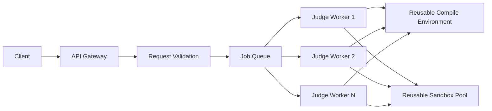

# YexJudge Architecture

## Overview

YexJudge is an asynchronous online judge designed for safe and efficient code execution at scale.

The long-term architecture separates request handling from code execution:

- The API layer validates and accepts submissions.
- Valid submissions are pushed to a queue.
- Judge workers pull jobs from the queue.
- Workers compile code using a reusable compile environment.
- Workers borrow an isolated runtime sandbox from a sandbox pool.
- All test cases for a single submission run inside the same borrowed sandbox.
- After execution, the sandbox is reset and returned to the pool.

This design avoids executing submissions directly in the HTTP request path, avoids creating a fresh runtime container for every test case, and prepares the system for horizontal scaling.

## Target Architecture

## Core Principles

### 1. Thin API Layer

The API layer should only:

- decode requests
- validate payloads
- reject unsupported or wasteful jobs early
- enqueue accepted submissions
- expose status and result endpoints

The API layer should not compile or execute user code directly.

### 2. Async Execution Model

Submission execution must happen asynchronously through workers.

Flow:

1. Client submits code.
2. API validates request.
3. API stores or enqueues submission.
4. Worker picks up the job.
5. Worker compiles code.
6. Worker borrows a runtime sandbox.
7. Worker runs all test cases.
8. Worker stores the final verdict.
9. Client polls or fetches the result.

This improves:

- API responsiveness
- fault isolation
- throughput under load
- easier retry and recovery behavior

### 3. Reusable Compile Environment

Compilation should not create a fresh container for every submission forever.

Instead, YexJudge should use a reusable compile environment or compile worker model.

Responsibilities:

- provide language toolchains
- compile source into artifacts
- keep compile concerns separate from runtime isolation
- reduce cold start overhead

This environment may still be isolated, but it should be optimized for repeated compilation work rather than one-off container startup.

### 4. Reusable Runtime Sandbox Pool

Runtime execution should use a pool of pre-created isolated sandboxes.

Each worker:

- borrows one sandbox for a submission
- runs all test cases in that sandbox
- resets the sandbox after the submission completes
- returns it to the pool

This avoids:

- creating a new runtime container for every test case
- paying full startup cost for every submission

### 5. One Sandbox Per Submission

All test cases for a single submission should run in the same borrowed sandbox.

Benefits:

- much lower overhead than per-test-case container creation
- easier runtime accounting for a submission
- clean boundary for sandbox reset after completion

The judge still evaluates test cases sequentially and returns on first failure unless future policy changes.

## Main Components

### API Gateway

Responsibilities:

- request size limiting
- schema validation
- supported-language validation
- auth and rate limiting in future
- enqueueing valid submissions

### Job Queue

Responsibilities:

- decouple API from execution
- buffer bursts of traffic
- support retries and worker scaling

### Judge Worker

Responsibilities:

- pull jobs from queue
- resolve language pipeline
- compile submission
- borrow sandbox
- run test cases
- compute verdict
- persist result

### Compile Environment

Responsibilities:

- provide compiler and interpreter toolchains
- produce build artifacts
- stay separate from runtime sandbox

### Sandbox Pool

Responsibilities:

- provide isolated runtime environments
- enforce resource limits
- reset environment after execution
- support reuse safely
