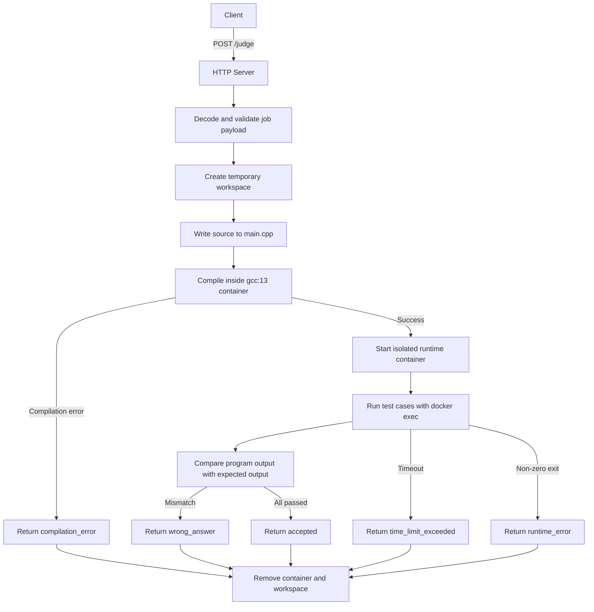
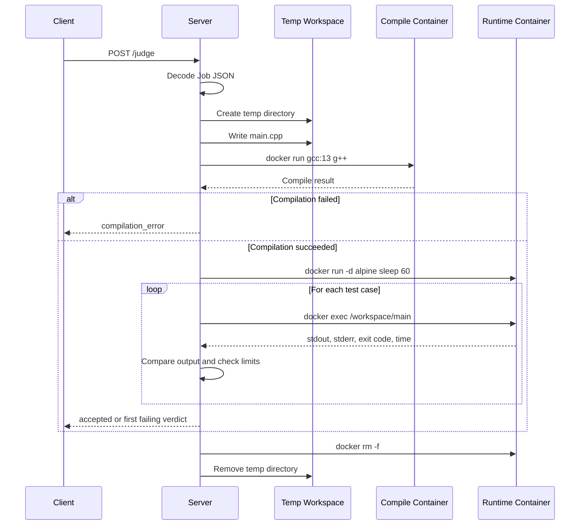
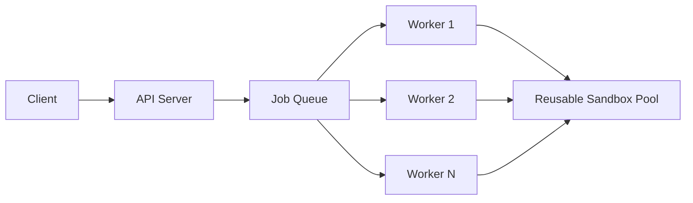

# YexJudge Architecture

## Overview

YexJudge is an HTTP-based online judge for code submissions. The current implementation accepts a submission, compiles the source code inside Docker, executes the compiled binary against each test case inside an isolated runtime container, and returns the first failing verdict or `accepted` if all test cases pass.

The system is intentionally simple at this stage:

- A single HTTP server exposes the API.
- Each request gets its own temporary workspace on the host.
- Compilation is performed in a short-lived `gcc:13` container.
- Execution is performed in a dedicated sandbox container with CPU, memory, PID, and network restrictions.
- Test cases are evaluated sequentially.

## Current Architecture



## Main Components

### 1. API Server

The API server is implemented in [`cmd/server/main.go`](/home/pixels/Documents/Projects/YexJudge/cmd/server/main.go). It exposes:

- `GET /health` for a simple liveness check
- `POST /judge` for submission evaluation

The server is responsible for:

- reading and decoding the request body
- creating a temporary workspace
- writing the submitted source file
- invoking the runner for compilation and execution
- building the final judge response

### 2. Judge Data Model

The request and response types live in [`internal/judge/types.go`](/home/pixels/Documents/Projects/YexJudge/internal/judge/types.go).

Core request fields:

- `language`
- `sourceCode`
- `testCases`
- `limits.timeLimitMs`
- `limits.memoryLimitMb`

Core response fields:

- `status`
- `runtimeMs`
- `memoryMb`
- `failedTestCase`
- `errorMessage`

Supported verdicts:

- `accepted`
- `wrong_answer`
- `time_limit_exceeded`
- `runtime_error`
- `compilation_error`
- `memory_limit_exceeded`

Note: `memory_limit_exceeded` exists in the model, but the current server flow does not yet produce that verdict explicitly.

### 3. Runner Abstraction

The runner interface is defined in [`internal/runner/runner.go`](/home/pixels/Documents/Projects/YexJudge/internal/runner/runner.go).

Its purpose is to separate execution mechanics from judge orchestration:

```go
type Runner interface {
    Run(ctx context.Context, input string, cmd string, args ...string) (*RunResult, error)
}
```

This keeps the server logic independent from the concrete process execution strategy.

### 4. Docker Runner

The current implementation uses [`internal/runner/docker_runner.go`](/home/pixels/Documents/Projects/YexJudge/internal/runner/docker_runner.go).

Responsibilities:

- start external commands with context cancellation
- stream stdin to the command
- capture stdout and stderr
- record execution time
- detect timeout via context deadline
- kill the full process group if execution exceeds the deadline

Execution metadata is stored in [`internal/runner/result.go`](/home/pixels/Documents/Projects/YexJudge/internal/runner/result.go).

## Request Lifecycle



## Execution Model

### Compilation

Submitted code is written to `main.cpp` in a temporary host workspace. The server then compiles it with:

- image: `gcc:13`
- output binary: `/workspace/main`

If compilation fails, the request ends immediately with `compilation_error` and the compiler stderr is returned as `errorMessage`.

### Runtime Isolation

If compilation succeeds, the server starts a runtime container and keeps it alive briefly while running test cases with `docker exec`.

Current isolation settings include:

- `--memory <limit>m`
- `--cpus 1`
- `--network none`
- `--pids-limit 64`
- `--security-opt no-new-privileges`
- `--tmpfs /tmp`
- mounted workspace at `/workspace`

This is a practical first step toward sandboxing, though it is still lighter-weight than a dedicated judge sandbox like gVisor, nsjail, or Firecracker.

### Test Case Evaluation

For each test case, the server:

1. creates a per-test timeout context using `limits.timeLimitMs`
2. runs the compiled binary inside the existing container
3. trims stdout and expected output
4. compares them for exact match
5. returns immediately on the first failing test

The final runtime reported to the client is the maximum runtime observed across all test cases.

## Design Characteristics

### Strengths

- small and easy-to-understand architecture
- clear separation between HTTP handling and command execution
- basic process isolation using Docker
- per-request workspace cleanup
- deterministic first-failure verdict handling

### Current Limitations

- single-node design with no queue or worker pool
- one submission is handled directly in the request path
- compilation still creates a fresh container per request
- runtime memory usage is not measured or reported yet
- no persistent sandbox reuse
- no language-specific execution pipeline beyond the current C++ flow

## Future Architecture Direction

As throughput requirements grow, the most natural next step is moving from direct request execution to a queue-backed worker model with reusable sandboxes.



That design would improve:

- latency by reducing container startup overhead
- throughput under concurrent load
- fault isolation between API and execution workers
- horizontal scalability

## Summary

The current YexJudge architecture is a solid minimal judge implementation: simple HTTP API, temporary workspace creation, Docker-based compilation, isolated execution, and sequential verdict evaluation. It is well suited for early development and correctness testing, while leaving a clear upgrade path toward a worker-pool and sandbox-reuse model as the system matures.
