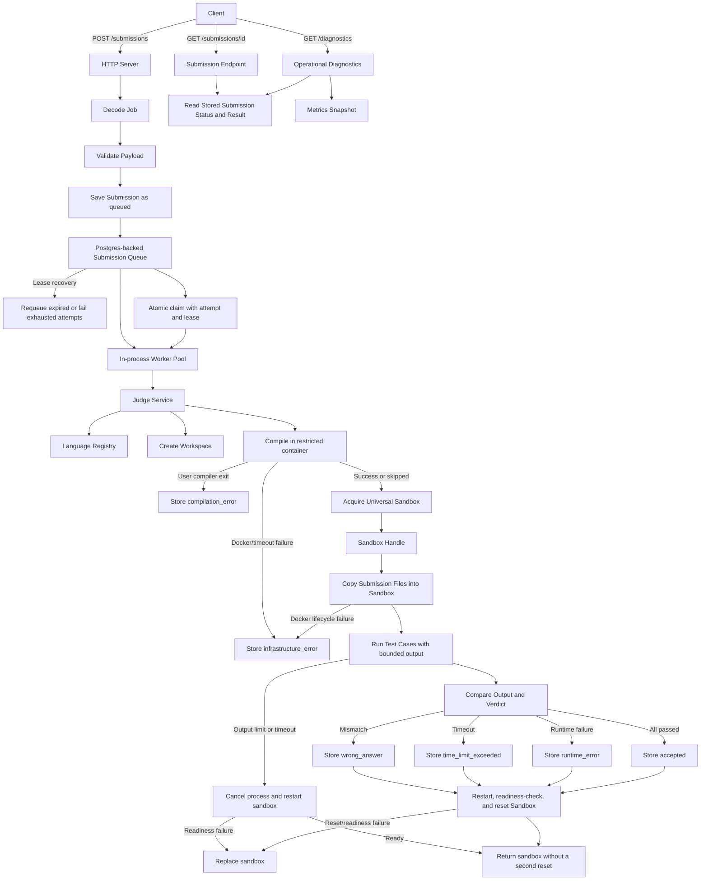
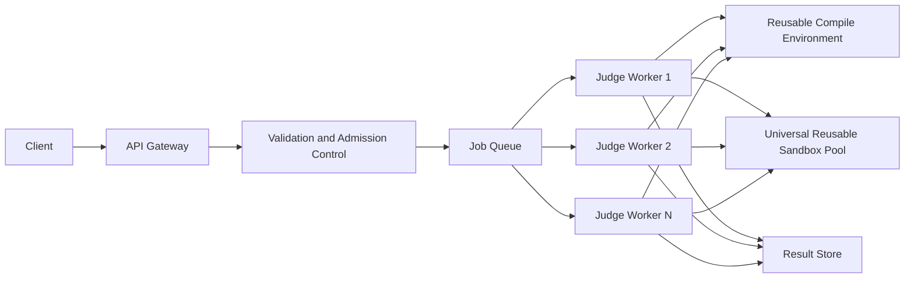

# YexJudge Architecture

## Overview

YexJudge is an online judge that now supports asynchronous submission processing in a single process, and is being shaped toward a more durable worker-based architecture with reusable execution infrastructure.

The project has two important architectural states:

- the current codebase architecture
- the intended target architecture

The current refactor has already established the core components needed for:

- multiple languages
- a reusable universal runtime sandbox pool
- worker pools
- queue-backed asynchronous execution
- stronger API-side validation
- a first version of LeetCode-style C++ function-mode submissions

## Current Architecture

Today, a submission is accepted through HTTP, stored in Postgres, claimed through a Postgres-backed queue, and processed by an in-process worker pool. Workers borrow pre-created containers from one universal runtime sandbox pool.

The code is now split into these layers:

- HTTP layer in [`cmd/server/main.go`](cmd/server/main.go)
- submission retrieval endpoint in [`cmd/server/submissions.go`](cmd/server/submissions.go)
- judge orchestration in [`internal/judge/service.go`](internal/judge/service.go)
- execution mechanics in [`internal/judge/executor.go`](internal/judge/executor.go)
- sandbox lifecycle abstraction in [`internal/judge/pool.go`](internal/judge/pool.go)
- test case loop and verdicting in [`internal/judge/testcases.go`](internal/judge/testcases.go)
- language-specific behavior in [`internal/judge/languages/spec.go`](internal/judge/languages/spec.go)
- C++ function harness generation in [`internal/judge/cpp_function_harness.go`](internal/judge/cpp_function_harness.go)
- Postgres submission store in [`internal/judge/postgres_store.go`](internal/judge/postgres_store.go)
- Postgres submission queue in [`internal/judge/postgres_queue.go`](internal/judge/postgres_queue.go)

### Current Flow

```mermaid
flowchart TD
    Client[Client] -->|POST /submissions| Server[HTTP Server]
    Server --> Decode[Decode Job]
    Decode --> Validate[Validate Payload]
    Validate --> Store[Save Submission as queued]
    Store --> Queue[Postgres-backed Submission Queue]
    Queue --> Worker[In-process Worker Pool]
    Queue -->|Lease recovery| Recovery[Requeue expired or fail exhausted attempts]
    Queue --> Claim[Atomic claim with attempt and lease]
    Claim --> Worker
    Worker --> Service[Judge Service]
    Service --> Registry[Language Registry]
    Service --> Workspace[Create Workspace]
    Service --> Compile[Compile in restricted container]
    Compile -->|User compiler exit| CE[Store compilation_error]
    Compile -->|Docker/timeout failure| IE[Store infrastructure_error]
    Compile -->|Success or skipped| Acquire[Acquire Universal Sandbox]
    Acquire --> Sandbox[Sandbox Handle]
    Sandbox --> Stage[Copy Submission Files into Sandbox]
    Stage -->|Docker lifecycle failure| IE
    Stage --> Execute[Run Test Cases with bounded output]
    Execute --> Compare[Compare Output and Verdict]
    Compare -->|Mismatch| WA[Store wrong_answer]
    Compare -->|Timeout| TLE[Store time_limit_exceeded]
    Compare -->|Runtime failure| RE[Store runtime_error]
    Compare -->|All passed| AC[Store accepted]
    WA --> Reset
    TLE --> Reset
    RE --> Reset
    Execute -->|Output limit or timeout| Restart[Cancel process and restart sandbox]
    Restart -->|Readiness failure| Replace[Replace sandbox]
    Restart -->|Ready| Release[Return sandbox without a second reset]
    AC --> Reset[Restart, readiness-check, and reset Sandbox]
    Reset -->|Reset/readiness failure| Replace
    Reset --> Release
    Client -->|GET /submissions/id| Fetch[Submission Endpoint]
    Fetch --> StoreLookup[Read Stored Submission Status and Result]
    Client -->|GET /diagnostics| Diagnostics[Operational Diagnostics]
    Diagnostics --> StoreLookup
    Diagnostics --> Metrics[Metrics Snapshot]
```

### Current Components

#### 1. HTTP Layer

The HTTP layer is intentionally thin.

Responsibilities:

- receive `POST /submissions`
- receive `POST /submit` as a bounded synchronous convenience endpoint
- receive `GET /submissions/{id}`
- receive `GET /diagnostics` for aggregate operational visibility
- decode strict request JSON
- enforce the 1 MiB request-size limit
- attach or preserve a safe `X-Request-ID`
- return structured JSON errors
- validate obvious bad input early
- create and store queued submissions
- enqueue accepted submissions
- return submission acceptance metadata
- optionally wait for a bounded period and return the final result
- return stored submission status and result
- return submission counts, worker/sandbox utilization, and bounded latency histograms

This layer should not contain compilation or execution logic.

#### 2. Judge Service

The judge service is the orchestration layer.

Responsibilities:

- process an already-created submission
- validate jobs defensively
- resolve the language spec
- create the workspace
- generate a C++ function harness when a job uses LeetCode-style function mode
- compile if the language requires compilation
- acquire a sandbox
- run all test cases
- map execution results into judge verdicts
- update submission lifecycle state in the store

This is the main business-logic layer of the judge.

#### 3. Executor

The executor is the infrastructure layer that knows how to interact with Docker.

Responsibilities:

- compile code inside the correct compile image
- enforce Docker exit-code checks and retain capped stderr diagnostics for lifecycle failures
- apply compile isolation: no network, bounded CPU/memory/PIDs, read-only root, tmpfs workspace, and unprivileged execution
- start universal runtime sandboxes during server startup
- readiness-check a sandbox after startup and restart before reuse
- configure a borrowed sandbox with the submission memory limit
- copy submission files into a borrowed sandbox
- cancel and restart a sandbox after timeout/output-limit execution, without double-resetting it on release
- replace a sandbox when reset or readiness fails
- execute one test case command inside the sandbox
- cap stdout and stderr at 64 KiB per stream

The executor should know how execution happens, but not what verdict should be returned.

#### 4. Sandbox Handle and Pool

The current code already introduces:

- a `Sandbox` handle abstraction
- a `SandboxPool` abstraction

The runtime pool now uses one shared custom image: `yexjudge-runtime:latest`.

Current behavior:

- the server pre-creates a fixed number of universal sandboxes at startup
- `Acquire` borrows an available sandbox
- source files or compiled artifacts are copied into the borrowed sandbox
- `Release` restarts the container to terminate remaining processes and clear temporary workspace state, then waits for readiness
- if execution already restarted a sandbox, release returns it without a second reset
- failed reset/readiness checks remove the old container and start a replacement
- all returned sandboxes are readiness-checked before reuse

The custom runtime image is based on Debian slim and includes Python and a Java runtime. Compilers remain outside runtime sandboxes.

#### 5. Submission Store and Queue

The current async path can be backed by Postgres.

Current behavior:

- submissions are stored in the `submissions` table
- job payloads and results are stored as JSONB
- workers claim queued submissions with `FOR UPDATE SKIP LOCKED`
- claiming changes a submission from `queued` to `running`, increments `attempt_count`, and sets `started_at` and `lease_expires_at`
- workers renew the lease while processing; renewals and final updates are fenced by `attempt_count`
- expired leases are requeued up to the configured retry limit, then become `failed` with an `infrastructure_error` result
- completed judge verdicts are updated to `finished` with a result payload

`DATABASE_URL` is required so the server always uses the durable path.

#### 6. Language Registry

Languages are not hardcoded in the service anymore.

Each language spec defines:

- source file name
- whether compilation is required
- compile image
- compile command
- runtime command

The registry maps a requested language string to the correct language spec. Runtime image choice is intentionally global because every reusable sandbox supports all configured languages.

#### 7. Operational Metrics and Diagnostics

The process maintains bounded in-memory histograms for queue wait, compile, sandbox acquisition, staging, testcase/runtime execution, and sandbox reset durations. Worker busy count and runtime-pool availability are tracked atomically. `GET /diagnostics` combines those metrics with aggregate Postgres queued/running/failed counts; structured JSON logs carry per-submission identity, worker, attempt, status, and timing fields.

### Current Supported Languages

The codebase is structured to support multiple languages through specs. The current stdin/stdout runtime set includes:

- C++
- C
- Python
- Go (legacy path; no new backend work planned while removal is evaluated)
- Java

C++ is the only active target for LeetCode-style Function Mode and future Class Mode work. Python and Java are deferred until the C++ roadmap is complete.

The shared `yexjudge-runtime:latest` image must be built locally before starting the server.

### Current Strengths

- HTTP code is much cleaner than the original monolithic handler
- submission processing is now asynchronous from the client's point of view
- submission status can be fetched separately through `GET /submissions/{id}`
- execution logic is no longer mixed with transport logic
- multi-language support now has a proper abstraction
- one borrowed sandbox is used for all test cases of a submission
- runtime sandbox creation is no longer required for each submission
- multiple in-process workers consume submissions concurrently

### Current Limitations

- a fresh compile container is still created per compiled submission
- retries are bounded by `QUEUE_MAX_ATTEMPTS` and use the queue lease metadata
- Postgres schema changes are applied through `db/submissions.sql` and numbered migration files

## Target Architecture

The long-term direction is an asynchronous online judge with dedicated workers, reusable compile infrastructure, and reusable runtime sandboxes.

```mermaid
flowchart LR
    Client[Client] --> Gateway[API Gateway]
    Gateway --> Validate[Validation and Admission Control]
    Validate --> Queue[Job Queue]
    Queue --> Worker1[Judge Worker 1]
    Queue --> Worker2[Judge Worker 2]
    Queue --> WorkerN[Judge Worker N]
    Worker1 --> CompilePool[Reusable Compile Environment]
    Worker2 --> CompilePool
    WorkerN --> CompilePool
    Worker1 --> SandboxPool[Universal Reusable Sandbox Pool]
    Worker2 --> SandboxPool
    WorkerN --> SandboxPool
    Worker1 --> Results[Result Store]
    Worker2 --> Results
    WorkerN --> Results
```

## Target Principles

### 1. Thin API Gateway

The gateway should only:

- validate payloads
- reject bad or wasteful submissions
- authenticate and rate-limit in future
- enqueue accepted jobs
- expose status and result endpoints

The gateway should not compile or run code directly.

### 2. Queue-Backed Async Execution

Submission execution should move fully out of the HTTP request path.

Target flow:

1. client submits code
2. gateway validates request
3. gateway enqueues job
4. worker picks up job
5. worker compiles code
6. worker borrows sandbox
7. worker runs all test cases
8. worker stores verdict
9. client polls for result

Benefits:

- low-latency API responses
- cleaner fault isolation
- better throughput under burst load
- easier retries and recovery

### 3. Reusable Compile Infrastructure

Compiled languages should not rely forever on one-off compile container startup.

The target model is:

- a reusable compile environment
- or a compile worker pool

This keeps toolchains available without rebuilding execution state for every submission.

Compile and runtime should remain separate concerns. The recommended model is not to use the exact same container for both compile and execution.

### 4. Universal Reusable Runtime Sandbox Pool

Runtime isolation uses a pool of pre-created containers built from one shared runtime-only image.

Each worker should:

- acquire one sandbox for the submission
- run all test cases in that sandbox
- reset sandbox state after execution
- release it back to the pool

This is the main path to avoiding repeated runtime container creation per submission while still keeping isolation.

### 5. One Sandbox Per Submission

The execution model should remain:

- one sandbox per submission
- many test cases inside that same sandbox

This keeps execution efficient while preserving clear reset boundaries.

## Recommended End-State

The best balance of speed and security for YexJudge is:

- async API
- queue-backed workers
- separate compile and runtime phases
- reusable compile environments
- universal reusable runtime sandbox pool
- one sandbox per submission

This avoids:

- direct execution in the request path
- container startup per test case
- mixing compile tooling into runtime sandboxes unnecessarily

## Next Work Order

The actionable implementation order is maintained in [`plan.md`](plan.md). This architecture document describes system boundaries and target principles; `plan.md` owns sequencing, runtime verification, hardening, recovery, testing, observability, capacity, and compile-performance work.

Keep the documents aligned when the target architecture or public behavior changes.

## Design Notes

### Validation Strategy

Validation should exist in two places:

- HTTP layer for immediate `400 Bad Request` responses
- service layer as defensive validation

This keeps the system safe even after multiple entrypoints or worker paths are introduced.
Current admission and execution caps include a 1 MiB JSON request body, 64 KiB stdout/stderr per stream, at most 10000ms per test case, and 512MB of sandbox memory. Compile containers and runtime sandboxes are network-disabled and resource-limited. All execution goes through the durable submission queue; `POST /submit` is the bounded synchronous convenience wrapper.

### Language Strategy

Each language should describe its own:

- compile image
- compile command
- runtime command

All languages execute in the configured universal runtime image. This avoids maintaining separate runtime pools while keeping compiler toolchains out of the execution sandbox.

C++ also supports a LeetCode-style function mode. In that mode, the request includes function metadata such as function name, return type, and parameter types. The judge generates a hidden C++ driver that constructs each test case, calls `Solution.<functionName>`, serializes the return value, and then uses the normal verdict comparison path.
The current implementation supports that path for C++ only. It is intentionally the first step toward broader driver-based problem formats, but no other language backend will be added until the C++ custom-type and Class Mode roadmap is complete. Python and Java remain future work; Go is not a planned driver backend and may be removed after a separate compatibility decision.

### Pool Strategy

The current `ExecutorSandboxPool` borrows warm universal sandboxes and returns them after a restart plus bounded readiness check. Timeout/output-limit execution restarts the sandbox immediately and marks it so release does not double-reset it. Failed reset/readiness checks remove the old container and replace it; graceful server shutdown removes the startup-created pool containers.

Future hardening should add failure recovery for lost pool capacity and durable worker coordination.

## Summary

YexJudge is currently an asynchronous single-process judge with a much cleaner internal architecture than before: thin server layer, submission queueing, background worker processing, explicit service orchestration, executor abstraction, sandbox handle and pool abstraction, and language-based execution pipelines.

The long-term target remains an asynchronous, queue-backed, worker-driven judge with reusable compile environments and reusable runtime sandbox pools. The current refactor is intentionally aimed at making that transition possible without rewriting the core judging logic again.
