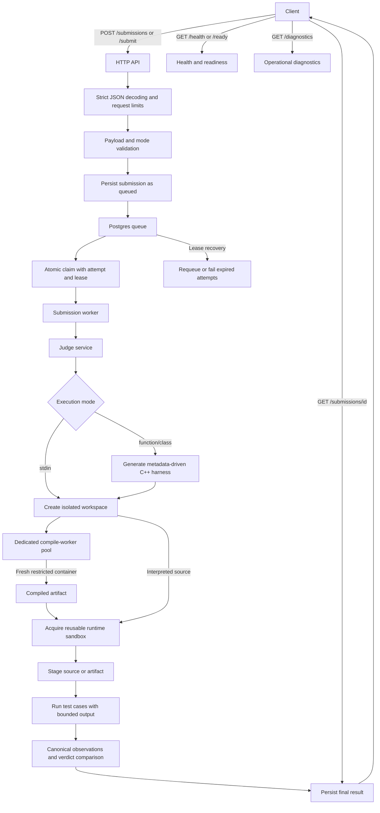

# YexJudge Architecture

## Overview

YexJudge is an asynchronous online judge and language runtime written in Go. It accepts source-code submissions, validates and persists them in PostgreSQL, processes them through leased background workers, compiles them in restricted disposable environments, and executes them inside reusable Docker sandboxes.

The implementation is intentionally driven by execution semantics and data types rather than algorithm categories or individual problem names. A new ordinary problem should require only metadata and test cases; YexJudge code changes are reserved for genuinely new execution modes or runtime data types.

The completed system is C++-first for metadata-driven LeetCode-style submissions while retaining conventional stdin/stdout support for C, C++, Python, Go, and Java.

## System Flow


```mermaid
flowchart TD
    Client[Client] -->|POST /submissions or /submit| API[HTTP API]
    API --> Decode[Strict JSON decoding and request limits]
    Decode --> Validate[Payload and mode validation]
    Validate --> Store[Persist submission as queued]
    Store --> Queue[Postgres queue]
    Queue --> Claim[Atomic claim with attempt and lease]
    Claim --> Worker[Submission worker]
    Worker --> Service[Judge service]
    Service --> Mode{Execution mode}
    Mode -->|stdin| Workspace[Create isolated workspace]
    Mode -->|function/class| Harness[Generate metadata-driven C++ harness]
    Harness --> Workspace
    Workspace --> Compile[Dedicated compile-worker pool]
    Compile -->|Fresh restricted container| Artifact[Compiled artifact]
    Artifact --> Sandbox[Acquire reusable runtime sandbox]
    Workspace -->|Interpreted source| Sandbox
    Sandbox --> Stage[Stage source or artifact]
    Stage --> Execute[Run test cases with bounded output]
    Execute --> Observe[Canonical observations and verdict comparison]
    Observe --> Result[Persist final result]
    Result --> Client
    Queue -->|Lease recovery| Recovery[Requeue or fail expired attempts]
    Client -->|GET /submissions/id| Result
    Client -->|GET /health or /ready| Health[Health and readiness]
    Client -->|GET /diagnostics| Diagnostics[Operational diagnostics]
```

## Architectural Boundaries

### 1. HTTP API

The HTTP layer is deliberately thin. It is responsible for transport, request validation, persistence, and result retrieval—not compilation or code execution.

Supported routes:

- `POST /submissions` — create an asynchronous submission and return `202` with an ID.
- `POST /submit` — create a submission and wait for a bounded period; returns the result directly when available or `202` when polling is required.
- `POST /judge` — compatibility alias for submission creation.
- `GET /submissions/{id}` — retrieve status and result.
- `GET /health` — process liveness check.
- `GET /ready` — dependency and capacity readiness check.
- `GET /diagnostics` — aggregate operational counts, capacity, and timing histograms.

API protections include strict JSON decoding, rejection of unknown fields and trailing values, a `1 MiB` request limit, safe request IDs, and structured JSON errors.

### 2. Judge Service

[`internal/judge/service.go`](internal/judge/service.go) orchestrates a claimed submission:

1. defensively validate the job
2. resolve the language specification
3. create a private workspace
4. generate a mode-specific harness when required
5. submit compilation to the dedicated compile-worker pool when required
6. acquire and configure a runtime sandbox
7. stage source or compiled artifacts
8. execute all test cases
9. map execution into a verdict
10. persist the result behind the submission lease fence

The service does not contain logic for Two Sum, LRU Cache, tree DP, graph traversal, or any other algorithmic problem.

### 3. Execution Modes

Execution mode is a first-class contract independent of language backend:

- **stdin/stdout mode** — execute user source with test-case input and compare output.
- **Function Mode** — construct typed arguments, instantiate `Solution`, invoke one method, and serialize declared observations.
- **Class Mode** — construct a user class and execute a metadata-defined sequence of operations.
- **Interactive, SQL, and Shell modes** — reserved for future contracts and separate runtimes.

Function and Class Mode currently have a C++ backend. The shared mode, observation, validation, and comparison boundaries are designed so another backend does not require changes to queueing, workers, sandboxes, or verdict storage.

## C++ Metadata-Driven Harness Runtime

### Recursive type system

The C++ harness uses recursive type references rather than a registry entry for every container combination. Qualifiers and reference forms are normalized internally, so declarations such as these resolve through the same type system:

```text
vector<int>
vector<vector<int>>
const vector<int>&
optional<vector<int>>
vector<TreeNode*>
```

Container support is implemented generically as `vector<T>`, allowing nested vectors and compositions with registered runtime types without adding a new generator for each combination.

### Supported value and runtime types

The current C++ backend supports:

- `int`
- `long long`
- `double`
- `bool`
- `string`
- recursive `optional<T>` values
- recursive `vector<T>` values
- `ListNode*`
- `TreeNode*`
- `RandomListNode*`
- LeetCode-style random-pointer `Node*`
- `GraphNode*`

The registered runtime adapters define construction, serialization, cleanup, and any type-specific observation behavior. Adding a new hidden runtime type is an adapter-registration task; the core harness generator does not need problem-specific changes.

### Function Mode lifecycle

A function-mode harness is generated in separate stages:

1. emit headers and helper declarations
2. emit type constructors and serializers
3. include the user’s `class Solution` source
4. construct parameters from testcase metadata
5. invoke the declared member function
6. observe the return value and declared parameter mutations
7. enforce generic postconditions
8. emit canonical output for the existing verdict pipeline

The lifecycle supports:

- scalar and recursive vector returns
- reference and const-reference parameters
- in-place mutation observations
- `void` functions whose result is represented by mutated parameters
- prefix views driven by an integer return value
- linked-list, tree, random-pointer, and graph construction
- generic identity policies such as `disjoint` and `same_as`

Identity-sensitive checks compare object relationships inside the generated program. Raw memory addresses are never exposed in API results. This supports deep-copy contracts such as Copy List with Random Pointer without adding a generator for that individual problem.

### Class Mode lifecycle

Class Mode accepts metadata for:

- class name
- constructor parameter types
- operation names
- operation parameter types
- operation return types
- operation arguments and expected observations

The generated driver constructs the class once and executes the operation sequence. This already supports the execution shape used by Min Stack, LRU Cache, Trie, Browser History, and similar stateful designs without naming or hardcoding those problems.

## Queue, Recovery, and Persistence

PostgreSQL is both the durable submission store and the queue:

- job payloads and results are stored as JSONB
- workers claim queued rows using `FOR UPDATE SKIP LOCKED`
- claiming changes `queued` to `running`, increments `attempt_count`, and sets a lease
- workers renew leases while processing
- final updates are fenced by attempt number and active lease
- expired attempts are requeued up to `QUEUE_MAX_ATTEMPTS`
- exhausted attempts become failed infrastructure results
- completed judge verdicts remain `finished`

The schema baseline and numbered migrations are embedded into the server and applied automatically during startup. Migration application uses an advisory lock so concurrent server starts do not apply the same migration simultaneously.

## Compilation and Runtime Isolation

### Dedicated compile workers

Compilation is scheduled through a bounded `CompileWorkerPool`, controlled by `COMPILE_SLOTS`. Compile workers are separate from submission workers and runtime sandboxes.

Every compile request still receives:

- a fresh private workspace
- a fresh disposable Docker compile container
- no network access
- bounded CPU, memory, and process count
- a read-only container root filesystem
- a writable restricted temporary filesystem
- dropped capabilities and `no-new-privileges`
- an unprivileged compiler user
- bounded compiler stdout and stderr

The worker pool provides independent capacity, cancellation while queued or active, and clean shutdown without reusing compiler state between submissions.

A ten-iteration host benchmark measured approximately `2058.96 ms` warm average before the worker-pool change and `2050.74 ms` afterward. The negligible difference shows that compiler execution, rather than container cold start, dominates this workload; reusable compile containers were therefore not introduced.

### Reusable runtime sandbox pool

The server pre-creates a fixed pool of universal `yexjudge-runtime:latest` containers. Each submission:

- borrows one sandbox
- configures its memory limit
- stages source or compiled artifacts using tar-based transfer
- runs all test cases in that sandbox
- restarts the sandbox on release to terminate processes and clear temporary state
- readiness-checks it before reuse

Timeouts and output-limit breaches cancel execution and restart the sandbox immediately. Failed reset or readiness checks remove the unhealthy container and provision a replacement without silently reducing configured capacity. Graceful shutdown removes pool-owned containers.

One sandbox is used for all test cases of one submission, while different submissions remain isolated by reset boundaries and sandbox ownership.

## Resource Limits and Reliability

The system applies explicit limits to untrusted execution:

- request body: `1 MiB`
- compiler/runtime output: `64 KiB` per stdout/stderr stream
- test-case time limit: bounded by validated job limits
- runtime sandbox memory: bounded by validated configuration
- compiler CPU, memory, PID, filesystem, and network restrictions
- separate compile-worker, submission-worker, and runtime-sandbox capacities
- an `8 GiB` worst-case runtime/compile reservation budget for configuration validation

Verdicts distinguish accepted, wrong answer, time limit exceeded, runtime error, memory limit exceeded, compilation error, output limit exceeded, validation error, and infrastructure error. Failed test cases include actual output when available.

Submission leases and retry fencing prevent a stale worker from overwriting a result after another worker has recovered the submission.

## Observability

The server emits structured JSON logs containing submission identity, language, worker, attempt, status transitions, infrastructure failures, and execution-stage timings.

The in-memory metrics snapshot tracks:

- queue wait
- compile duration
- sandbox acquisition
- staging
- testcase/runtime execution
- sandbox reset
- queued, running, and failed submission counts
- worker busy/total capacity
- compile-worker capacity
- sandbox available, busy, and starting state

`GET /diagnostics` exposes aggregate operational state without returning source code or submission results.

## Configuration and Deployment

For local development:

```bash
cp .env.example .env
go run ./cmd/server
```

Explicit process environment variables override `.env`. The real `.env` file is ignored by Git; only `.env.example` is committed.

The server validates worker, sandbox, compile-worker, queue, timeout, and memory-budget configuration during startup.

A local all-in-one deployment is available through Docker Compose:

```bash
docker build -t yexjudge-runtime:latest -f docker/runtime/Dockerfile .
mkdir -p .yexjudge-workspaces
docker compose up --build
```

The Compose application mounts the Docker socket because YexJudge launches sibling compile and runtime containers. This is suitable for trusted local development, not an untrusted multi-tenant deployment. The project directory is mounted at the same absolute path so host Docker can resolve workspace bind mounts. Compose publishes its PostgreSQL service on host port `5433` by default while the application connects internally to `postgres:5432`.

Readiness checks distinguish a live process from a service that can safely accept work:

```bash
curl -i http://localhost:8080/health
curl -i http://localhost:8080/ready
```

## Supported Languages and Scope

Conventional stdin/stdout execution is available for:

- C++
- C
- Python
- Go
- Java

Metadata-driven C++ Function Mode and Class Mode are the active LeetCode-style implementations. Python and Java Function/Class backends are deliberately deferred. Go remains stdin/stdout-only while its long-term product status is evaluated.

## Validation and Test Coverage

The repository includes:

- validation and verdict unit tests
- recursive C++ harness tests
- custom runtime and identity-policy tests
- Class Mode tests for state transitions, invalid calls, and an LRU Cache eviction contract
- compile-worker cancellation, concurrency, and shutdown tests
- sandbox reset, replacement, readiness, and output-limit tests
- Postgres store, claim uniqueness, lease recovery, and stale-attempt tests
- API/Docker integration tests covering readiness, async polling, all current stdin languages, C++ Function/Class Mode, timeouts, and compilation errors
- an opt-in Docker compile benchmark
- `scripts/load-test.sh` for repeatable asynchronous admission measurements

The standard local checks are:

```bash
go test ./...
go test -race ./...
go vet ./...
```

Postgres-backed integration tests use `YEXJUDGE_TEST_DATABASE_URL`. Docker/API integration tests also require the runtime and compiler images. The current project has been verified with PostgreSQL, Docker Compose, readiness checks, and a clean post-test container state.

## Scope Boundaries

The completed architecture intentionally does not include:

- algorithm-specific judge logic
- problem-specific harnesses
- Python or Java Function/Class generation
- Go Function/Class generation
- adaptive capacity
- interactive, SQL, or Shell runtimes
- authentication or per-user rate limiting, because there is no user/account model yet

These are future extensions, not prerequisites for the completed C++-first service.
