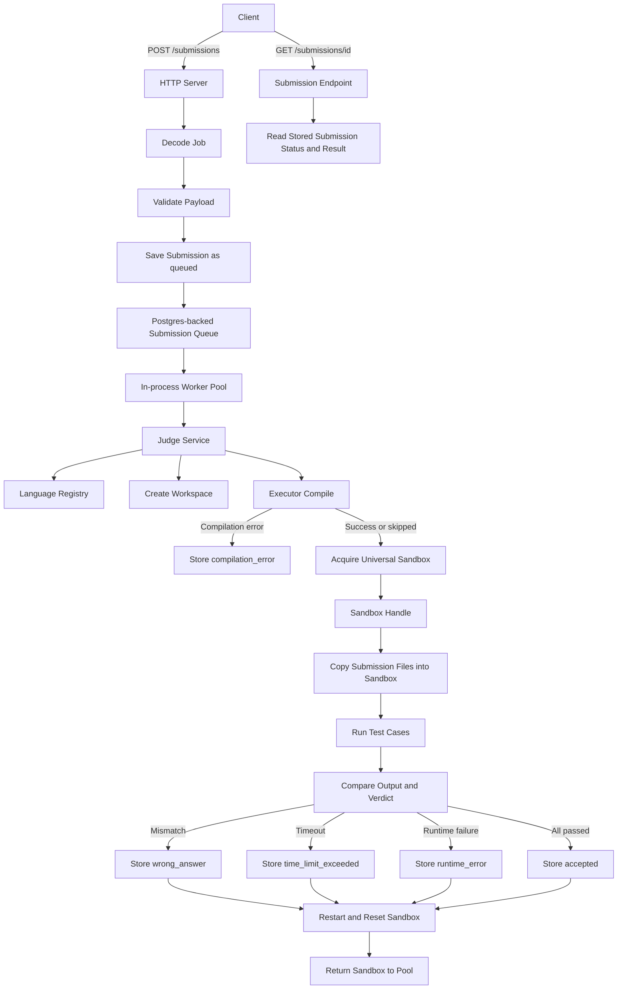
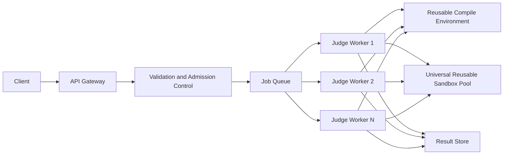

# YexJudge Architecture

## Overview

YexJudge is an online judge that now supports asynchronous submission processing in a single process, and is being shaped toward a more durable worker-based architecture with reusable execution infrastructure.

The project has two important architectural states:

- the current codebase architecture
- the intended target architecture

The current refactor has already established the core components needed for:

- multiple languages
- a reusable universal runtime sandbox pool
- worker pools
- queue-backed asynchronous execution
- stronger API-side validation
- a first version of LeetCode-style C++ function-mode submissions

## Current Architecture

Today, a submission is accepted through HTTP, stored in Postgres, claimed through a Postgres-backed queue, and processed by an in-process worker pool. Workers borrow pre-created containers from one universal runtime sandbox pool.

The code is now split into these layers:

- HTTP layer in [`cmd/server/main.go`](/home/pixels/Documents/Projects/YexJudge/cmd/server/main.go)
- submission retrieval endpoint in [`cmd/server/submissions.go`](/home/pixels/Documents/Projects/YexJudge/cmd/server/submissions.go)
- judge orchestration in [`internal/judge/service.go`](/home/pixels/Documents/Projects/YexJudge/internal/judge/service.go)
- execution mechanics in [`internal/judge/executor.go`](/home/pixels/Documents/Projects/YexJudge/internal/judge/executor.go)
- sandbox lifecycle abstraction in [`internal/judge/pool.go`](/home/pixels/Documents/Projects/YexJudge/internal/judge/pool.go)
- test case loop and verdicting in [`internal/judge/testcases.go`](/home/pixels/Documents/Projects/YexJudge/internal/judge/testcases.go)
- language-specific behavior in [`internal/judge/languages/spec.go`](/home/pixels/Documents/Projects/YexJudge/internal/judge/languages/spec.go)
- C++ function harness generation in [`internal/judge/cpp_function_harness.go`](/home/pixels/Documents/Projects/YexJudge/internal/judge/cpp_function_harness.go)
- Postgres submission store in [`internal/judge/postgres_store.go`](/home/pixels/Documents/Projects/YexJudge/internal/judge/postgres_store.go)
- Postgres submission queue in [`internal/judge/postgres_queue.go`](/home/pixels/Documents/Projects/YexJudge/internal/judge/postgres_queue.go)

### Current Flow

```mermaid
flowchart TD
    Client[Client] -->|POST /submissions| Server[HTTP Server]
    Server --> Decode[Decode Job]
    Decode --> Validate[Validate Payload]
    Validate --> Store[Save Submission as queued]
    Store --> Queue[Postgres-backed Submission Queue]
    Queue --> Worker[In-process Worker Pool]
    Worker --> Service[Judge Service]
    Service --> Registry[Language Registry]
    Service --> Workspace[Create Workspace]
    Service --> Compile[Executor Compile]
    Compile -->|Compilation error| CE[Store compilation_error]
    Compile -->|Success or skipped| Acquire[Acquire Universal Sandbox]
    Acquire --> Sandbox[Sandbox Handle]
    Sandbox --> Stage[Copy Submission Files into Sandbox]
    Stage --> Execute[Run Test Cases]
    Execute --> Compare[Compare Output and Verdict]
    Compare -->|Mismatch| WA[Store wrong_answer]
    Compare -->|Timeout| TLE[Store time_limit_exceeded]
    Compare -->|Runtime failure| RE[Store runtime_error]
    Compare -->|All passed| AC[Store accepted]
    WA --> Reset
    TLE --> Reset
    RE --> Reset
    AC --> Reset[Restart and Reset Sandbox]
    Reset --> Release[Return Sandbox to Pool]
    Client -->|GET /submissions/id| Fetch[Submission Endpoint]
    Fetch --> StoreLookup[Read Stored Submission Status and Result]
```

### Current Components

#### 1. HTTP Layer

The HTTP layer is intentionally thin.

Responsibilities:

- receive `POST /submissions`
- receive `POST /submit` as a bounded synchronous convenience endpoint
- receive `POST /run` for one-off sandboxed execution without persistence, test-case comparison, or user-provided stdin
- receive `GET /submissions/{id}`
- decode request JSON
- enforce request-size limit
- validate obvious bad input early
- create and store queued submissions
- enqueue accepted submissions
- return submission acceptance metadata
- optionally wait for a bounded period and return the final result
- execute one raw-stdin request synchronously through the existing compiler and sandbox infrastructure
- return stored submission status and result

This layer should not contain compilation or execution logic.

#### 2. Judge Service

The judge service is the orchestration layer.

Responsibilities:

- process an already-created submission
- validate jobs defensively
- resolve the language spec
- create the workspace
- generate a C++ function harness when a job uses LeetCode-style function mode
- compile if the language requires compilation
- acquire a sandbox
- run all test cases
- map execution results into judge verdicts
- update submission lifecycle state in the store

This is the main business-logic layer of the judge.

#### 3. Executor

The executor is the infrastructure layer that knows how to interact with Docker.

Responsibilities:

- compile code inside the correct compile image
- start universal runtime sandboxes during server startup
- configure a borrowed sandbox with the submission memory limit
- copy submission files into a borrowed sandbox
- release the sandbox
- execute one test case command inside the sandbox

The executor should know how execution happens, but not what verdict should be returned.

#### 4. Sandbox Handle and Pool

The current code already introduces:

- a `Sandbox` handle abstraction
- a `SandboxPool` abstraction

The runtime pool now uses one shared custom image: `yexjudge-runtime:latest`.

Current behavior:

- the server pre-creates a fixed number of universal sandboxes at startup
- `Acquire` borrows an available sandbox
- source files or compiled artifacts are copied into the borrowed sandbox
- `Release` restarts the container to terminate remaining processes and clear temporary workspace state
- the reset sandbox is returned to the pool

The custom runtime image is based on Debian slim and includes Python and a Java runtime. Compilers remain outside runtime sandboxes.

#### 5. Submission Store and Queue

The current async path can be backed by Postgres.

Current behavior:

- submissions are stored in the `submissions` table
- job payloads and results are stored as JSONB
- workers claim queued submissions with `FOR UPDATE SKIP LOCKED`
- claiming changes a submission from `queued` to `running`
- completed submissions are updated to `finished` with a result payload

`DATABASE_URL` is required so the server always uses the durable path.

#### 6. Language Registry

Languages are not hardcoded in the service anymore.

Each language spec defines:

- source file name
- whether compilation is required
- compile image
- compile command
- runtime command

The registry maps a requested language string to the correct language spec. Runtime image choice is intentionally global because every reusable sandbox supports all configured languages.

### Current Supported Languages

The codebase is structured to support multiple languages through specs. At this stage the intended supported set includes:

- C++
- C
- Python
- Go
- Java

The shared `yexjudge-runtime:latest` image must be built locally before starting the server.

### Current Strengths

- HTTP code is much cleaner than the original monolithic handler
- submission processing is now asynchronous from the client's point of view
- submission status can be fetched separately through `GET /submissions/{id}`
- execution logic is no longer mixed with transport logic
- multi-language support now has a proper abstraction
- one borrowed sandbox is used for all test cases of a submission
- runtime sandbox creation is no longer required for each submission
- multiple in-process workers consume submissions concurrently

### Current Limitations

- a fresh compile container is still created per compiled submission
- there is no worker recovery or retry model yet
- submissions already claimed as `running` are not recovered after a crash yet
- Postgres schema changes are applied manually through `db/submissions.sql`

## Target Architecture

The long-term direction is an asynchronous online judge with dedicated workers, reusable compile infrastructure, and reusable runtime sandboxes.

```mermaid
flowchart LR
    Client[Client] --> Gateway[API Gateway]
    Gateway --> Validate[Validation and Admission Control]
    Validate --> Queue[Job Queue]
    Queue --> Worker1[Judge Worker 1]
    Queue --> Worker2[Judge Worker 2]
    Queue --> WorkerN[Judge Worker N]
    Worker1 --> CompilePool[Reusable Compile Environment]
    Worker2 --> CompilePool
    WorkerN --> CompilePool
    Worker1 --> SandboxPool[Universal Reusable Sandbox Pool]
    Worker2 --> SandboxPool
    WorkerN --> SandboxPool
    Worker1 --> Results[Result Store]
    Worker2 --> Results
    WorkerN --> Results
```

## Target Principles

### 1. Thin API Gateway

The gateway should only:

- validate payloads
- reject bad or wasteful submissions
- authenticate and rate-limit in future
- enqueue accepted jobs
- expose status and result endpoints

The gateway should not compile or run code directly.

### 2. Queue-Backed Async Execution

Submission execution should move fully out of the HTTP request path.

Target flow:

1. client submits code
2. gateway validates request
3. gateway enqueues job
4. worker picks up job
5. worker compiles code
6. worker borrows sandbox
7. worker runs all test cases
8. worker stores verdict
9. client polls for result

Benefits:

- low-latency API responses
- cleaner fault isolation
- better throughput under burst load
- easier retries and recovery

### 3. Reusable Compile Infrastructure

Compiled languages should not rely forever on one-off compile container startup.

The target model is:

- a reusable compile environment
- or a compile worker pool

This keeps toolchains available without rebuilding execution state for every submission.

Compile and runtime should remain separate concerns. The recommended model is not to use the exact same container for both compile and execution.

### 4. Universal Reusable Runtime Sandbox Pool

Runtime isolation uses a pool of pre-created containers built from one shared runtime-only image.

Each worker should:

- acquire one sandbox for the submission
- run all test cases in that sandbox
- reset sandbox state after execution
- release it back to the pool

This is the main path to avoiding repeated runtime container creation per submission while still keeping isolation.

### 5. One Sandbox Per Submission

The execution model should remain:

- one sandbox per submission
- many test cases inside that same sandbox

This keeps execution efficient while preserving clear reset boundaries.

## Recommended End-State

The best balance of speed and security for YexJudge is:

- async API
- queue-backed workers
- separate compile and runtime phases
- reusable compile environments
- universal reusable runtime sandbox pool
- one sandbox per submission

This avoids:

- direct execution in the request path
- container startup per test case
- mixing compile tooling into runtime sandboxes unnecessarily

## Next Work Order

The core architecture is already in place. The remaining work should focus on recovery, hardening, observability, and compile performance.

### 1. End-to-End Runtime Verification

Finish this before adding more architecture.

Tasks:

- build `yexjudge-runtime:latest`
- start the server locally
- submit working and failing programs for C, C++, Python, Go, and Java
- verify `POST /submissions` returns `202 Accepted`
- verify `GET /submissions/{id}` transitions through `queued`, `running`, and `finished`
- verify accepted, wrong answer, runtime error, compilation error, and timeout verdicts

Reason:

The reusable runtime sandbox pool is now the most important execution path and should stay covered as other infrastructure changes land.

### 2. Fix Any Runtime Pool Issues Found During Testing

Tasks:

- confirm tar-based staging correctly stages source files and compiled artifacts into borrowed sandboxes
- confirm sandbox restart clears `/workspace` and `/tmp`
- confirm repeated submissions do not leak files or processes between runs
- confirm memory limits are applied correctly before execution
- confirm the runtime image has every command needed by language specs

Reason:

Reusable sandboxes are a major performance feature, but they must be clean between submissions.

### 3. Keep Final API Shape

Target routes:

- `POST /submissions`
- `GET /submissions/{id}`

Current compatibility route:

- `POST /judge`

Tasks:

- keep `/judge` temporarily as an alias if useful
- keep `/submissions` as the primary API

Reason:

The judge is now submission-oriented and asynchronous. The API should reflect that.

### 4. Harden Durable Submission Store and Queue

Current durable backend:

- Postgres-only

Tasks:

- keep `db/submissions.sql` in sync with code
- add schema migration tooling later
- add more useful error metadata for infrastructure failures
- add tests around Postgres store and queue behavior
- keep atomic `queued -> running` claims as the worker coordination boundary

Reason:

Postgres now gives durable storage and a good enough queue for this project stage without adding Redis. The remaining work is hardening and recovery, not replacing the basic storage path.

### 5. Add Worker Recovery and Retry Rules

Tasks:

- track `created_at`, `updated_at`, and possibly `started_at`
- detect submissions stuck in `running`
- define retry limits
- define when a stuck job becomes `failed`
- make workers claim jobs with a lease or timeout policy

Reason:

Durable queueing is incomplete without recovery. A worker crash should not leave submissions stuck forever.

### 6. Expand LeetCode-Style Function Harnesses

Tasks:

- support richer LeetCode-style payloads beyond simple primitive and one-dimensional vector arguments
- add hidden drivers for linked lists, trees, graphs, hash maps, and cache-style problems
- encode problem-specific input/output adapters so the judge can invoke the user code the way LeetCode does
- keep stdin-style submissions available for problems that still fit that model better

Reason:

The current function mode proves the approach, but real platform coverage needs reusable drivers and serializers for the common data structures used in judge problems.

### 7. Make Worker and Sandbox Capacity Adaptive

Tasks:

- scale worker count based on queue depth, job wait time, or recent throughput
- scale warm sandbox pool size based on active load and available memory
- add minimum and maximum bounds so autoscaling stays predictable
- define a simple policy first, then refine it with metrics after observing real traffic

Reason:

Fixed worker and sandbox counts are fine for local development, but an actual judge benefits from adapting capacity to bursty submission load.

### 8. Harden Runtime Sandbox Lifecycle

Tasks:

- clean up warm sandbox containers on graceful shutdown
- replace unhealthy sandboxes automatically
- expose pool size and available sandbox counts in logs or metrics
- make worker count and pool size configurable through environment variables

Reason:

The runtime pool is central to performance. It needs predictable lifecycle behavior before production use.

### 9. Harden Compilation

Tasks:

- add CPU, memory, PID, network, and timeout constraints to compile containers
- cap compiler output size
- classify compile infrastructure failures separately from user compilation errors
- consider reusable compile pools after the current one-off compile path is stable

Reason:

Compilation still starts fresh containers per compiled submission. Reusable compile containers can improve latency later, but compile sandbox hardening is more important first.

### 10. Add Focused Tests and Observability

Tasks:

- unit test validation rules
- unit test verdict mapping in test case evaluation
- integration test the async submission lifecycle
- add logs for queue size, worker starts, sandbox acquire/release, and verdicts
- later add metrics for queue depth, worker busy count, runtime duration, and compile duration

Reason:

The project is now complex enough that small regressions can hide in lifecycle behavior.

### 11. Consider Reusable Compile Infrastructure

Only do this after the runtime pool, durable store, and worker recovery are stable.

Target model:

- compile pools keyed by compile image or toolchain
- separate from runtime sandboxes
- reset compile workspace between submissions

Reason:

Compile reuse can reduce latency, but it is more complex and riskier than runtime reuse because compilers process untrusted input and toolchains are larger.

## Design Notes

### Validation Strategy

Validation should exist in two places:

- HTTP layer for immediate `400 Bad Request` responses
- service layer as defensive validation

This keeps the system safe even after multiple entrypoints or worker paths are introduced.
Current admission caps limit submissions to `10000ms` per test case and `512MB` of sandbox memory.

### Language Strategy

Each language should describe its own:

- compile image
- compile command
- runtime command

All languages execute in the configured universal runtime image. This avoids maintaining separate runtime pools while keeping compiler toolchains out of the execution sandbox.

C++ also supports a LeetCode-style function mode. In that mode, the request includes function metadata such as function name, return type, and parameter types. The judge generates a hidden C++ driver that constructs each test case, calls `Solution.<functionName>`, serializes the return value, and then uses the normal verdict comparison path.
The current implementation supports that path for C++ only, and it is intentionally the first step toward broader driver-based problem formats.

### Pool Strategy

The current `ExecutorSandboxPool` borrows warm universal sandboxes and returns them after reset. A container restart on release provides a practical cleanup boundary for temporary filesystem state and stray runtime processes.

Future hardening should add graceful server shutdown cleanup, failure recovery for lost pool capacity, and durable worker coordination.

## Summary

YexJudge is currently an asynchronous single-process judge with a much cleaner internal architecture than before: thin server layer, submission queueing, background worker processing, explicit service orchestration, executor abstraction, sandbox handle and pool abstraction, and language-based execution pipelines.

The long-term target remains an asynchronous, queue-backed, worker-driven judge with reusable compile environments and reusable runtime sandbox pools. The current refactor is intentionally aimed at making that transition possible without rewriting the core judging logic again.
